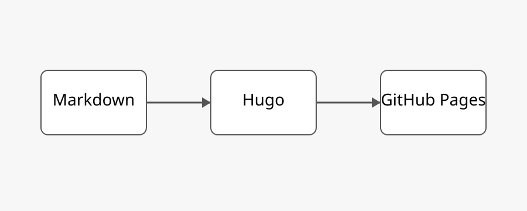

# Page Bundle のテスト

この記事は Page Bundle 形式です。

記事本体の `index.md` と画像ファイルを同じディレクトリに置けます。

## ディレクトリ構成

```text
page-bundle-sample/
├── index.md
├── sample-diagram.svg
└── memo.txt
```

## 画像

Markdown からは、同じディレクトリにある画像をそのまま相対パスで参照できます。

```markdown

```

実際の表示:


## メモ

実際の記事では、たとえば次のように置けます。

```text
timer-rev2/
├── index.md
├── schematic.png
├── pcb-top.png
├── pcb-bottom.png
└── assembled.jpg
```

記事と画像が1つのディレクトリにまとまるので、
あとから記事単位で移動・削除しやすくなります。
